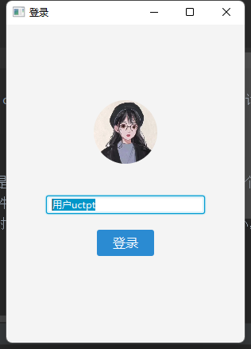

# JChat局域网聊天项目
项目使用javafx作为ui开发平台，基于udp和tcp实现聊天功能。

支持同一网络环境内多设备聊天（测试了多台windows、mac设备通过有线和无线连接到一个局域网的情况）。

通信的流程可以简单描述为：
1. 每个用户登录时会生成一个带uuid的用户信息
2. 使用udp向局域网多播自己的信息（只通过某一网卡，这个网卡必须连接到其它用户所在的网络）
3. 监听多播组中其它在线用户的信息
4. 连接其它在线用户并创建聊天会话
5. 发送和接收聊天消息
6. 如果聊天消息中有图片或者文件则创建文件会话下载对应的文件

**[视频演示 screen-record.mp4](./screen-record.mp4)**

屏幕截图

## 聊天组件简介
位于chat包下。

### ChatManager
管理所有聊天组件的类，实现：ChatManagerImpl

### ChatClient
1. 负责连接在线用户并创建ChatSession
2. 为每个ChatSession创建发送和接收线程
3. 把用户要发送的消息放到发送消息队列，发送线程会循环查询这个队列并把新的消息发送出去
4. 接收线程循环接收对方用户发来的消息，把新消息存到ChatMessageStore并通知对应的subscriber

### ChatMessageStore
简单的 in-memory 聊天消息存储

### ChatServer
1. 建立一个tcp监听ServerSocket
2. 循环接受新的tcp连接
3. tcp连接之后是应用会话建立过程，有ChatSession和FileSession，分别对应聊天消息会话和文件服务会话
4. 会话建立完成后，告知ChatManager

### FileManager
1. 根据用户id创建FileSession，FileSession是用于请求和响应文件资源，类似HTTP，一个请求对应一个响应
2. 根据用户需求创建文件下载任务请求下载对应的文件（包括聊天图片原图）
3. 监听FileSession（作为服务端）请求，并发送对应的文件资源，发送时先告知对方文件大小，然后再发送字节信息
4. 下载和发送文件进度更新时通知subscriber

### OnlineUserManager
1. 多播自己的信息
2. 监听多播，接收其它用户的信息
3. 在线用户列表更改时通知ChatManager

### SessionManager
1. 定时检查session，对超时的session进行关闭清理
2. 对意外关闭的session进行关闭清理
3. session移除时通知ChatManager

## 注意事项
1. 网络接口需要和其它用户连接在同一网络，比如连接到同一路由器， 当前的逻辑是遍历所有网络接口列表，排除本地环路和虚拟接口，找到第一个没有被排除的接口。
如果无法通信可以对OnlineUserManager类的`getDesiredInterface`方法进行调试和问题排查
2. 第一次运行项目或者更改配置后可能无法正常运行，有可能是jdk和javafx库冲突，我试过把pom.xml的java版本乱改，再刷新maven，然后再把java版本改回来就可以正常。
有时候点击javafx相关类的源码时会定位到旧版java9的代码，也是通过类似的办法解决。
